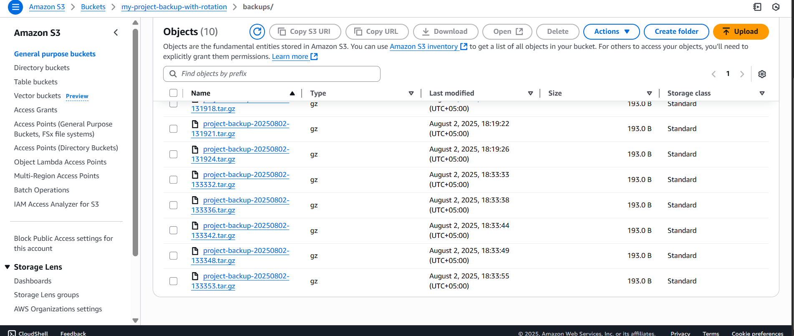
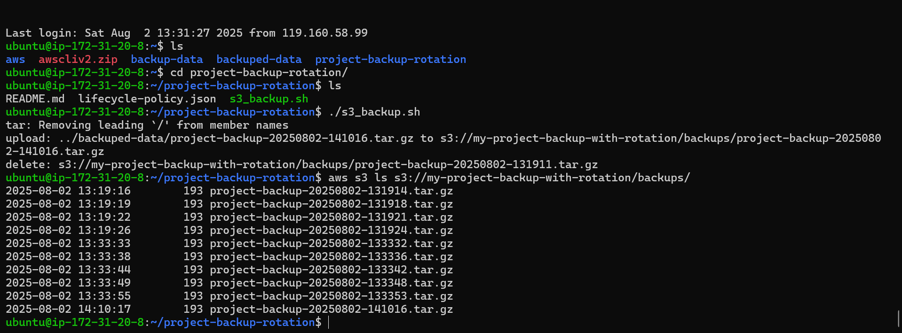

# 🔄 Automated AWS S3 Backup System

This project automates the backup of server directories to Amazon S3 using a Bash script with built-in rotation logic and AWS lifecycle policies.

---

## 🛠️ Tech Stack

- **AWS Services**
  - Amazon S3 (Storage)
  - IAM Roles & Policies (Access Management)
- **Automation & Backend**
  - Bash Scripting
  - Cron Jobs (Task Scheduler)
  - AWS CLI (Command Line Interface)
  - Linux (Ubuntu)

---

## 🚀 What I Implemented

- ✅ A Bash script that:
  - Compresses the `/home/ubuntu/project-backup-rotation` folder into `.tar.gz` files with timestamps
  - Uploads backups to an Amazon S3 bucket using AWS CLI
  - Keeps only the **10 most recent** backups and deletes older ones
- ✅ Configured **IAM role** with:
  - Custom policy allowing only S3 upload access
  - Attached the role securely to the EC2 instance
- ✅ Applied **S3 lifecycle policy** to:
  - Automatically delete backups older than 10 days
- ✅ Scheduled the script with **cron** to:
  - Run automatically at specified intervals (e.g., daily)

---

## 🔍 Key Features

- 💾 **Dual Rotation System**  
  Script deletes old backups locally after uploading, and S3 lifecycle deletes from the cloud after 10 days.

- ⚙️ **Fully Automated**  
  No manual effort needed after initial setup—everything runs in the background.

- 💸 **Cost-Efficient**  
  No unnecessary storage costs thanks to automated expiration.

---

## 📸 Screenshots
  
*Sample screenshot of backup files in S3 bucket*

  
*Script execution with verification steps*

